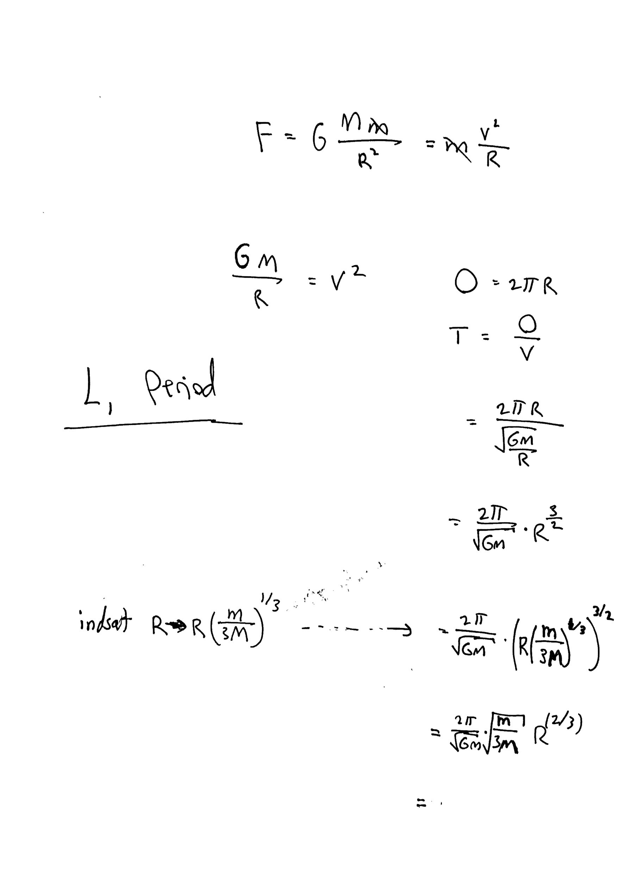

# Spørgsmål om mekanik til Poul

## Udtryk for L1 og sammenhæng med omløbstid

På Wikipedia [står der](https://en.wikipedia.org/wiki/Lagrangian_point#L1) at L1 kan udtrykkes som følgende:

> This distance can be described as being such that the orbital period, corresponding to a circular orbit with this distance as radius around M2 in the absence of M1, is that of M2 around M1, divided by $\sqrt{3} \approx 1.73$:

$$
T_{s,M_2}(r) = \frac{T_{M_2,M_1}(R)}{\sqrt{3}}
$$

Jeg har forsøgt at bekræfte dette udtryk nedenfor ved i formlen for omløbstid $T = \dfrac{2\pi}{\sqrt{G M}} R^{3/2}$ at indsætte $L_1 = R \left(\frac{m}{3M}\right)^{1/3}$ afstanden ind på R, men jeg det går ikke helt op.  Se udregning nedenfor:
{ width=100% }

#### Poul svarer

\leavevmode {\color{red}

Kigger lidt mere i dybden på udtrykkene for Lagrangepunkterne, så kan vi kigge på det senere.

}

## Jacobi integral

Hvad er [det](https://en.wikipedia.org/wiki/Jacobi_integral) og hvorfor er jeg ikke stødt på det før nu?

Specielt sætningen:
> ...so the energy measured in this system of reference (and hence, the Jacobi integral) is a constant of motion."

Jeg kan ved første øjenkast heller ikke lige genkende ligningerne, hvilket også undrer mig lidt.

Se også denne [figurtekst](https://en.wikipedia.org/wiki/Zero-velocity_surface#/media/File:Circular_restricted_3-body_problem.png) på Wikipedia:

> A trajectory (red) in the planar circular restricted 3-body problem that orbits the heavier body a number of times before escaping into an orbit around the lighter body. The contours denote values of the Jacobi integral. The dark blue region is an excluded region for the trajectory, enclosed by a zero-velocity surface that cannot be crossed.

#### Poul svarer

\leavevmode {\color{red}

Jacobi integral generelt er en bevægelseskonstant, som muligvis kan findes ud fra Noether's theorem. Man kan vise at det er en bevægelseskonstant vha. Poisson's linging:

$\{f,g\} = \sum\limits_{p,q}^{n} \left(\frac{\partial f}{\partial p} \frac{\partial g}{\partial q} - \frac{\partial f}{\partial q}\frac{\partial q}{\partial p} \right)$

hvor $q$ og $p$ er de generalisrede koordinater og impulser fra Hamilton mekanik.

}

## L4 og L5 intuition?

På Wikipedia [forklares](https://en.wikipedia.org/wiki/Lagrangian_point#L4_and_L5) intuitionen bag L4 og L5. Der påstas at L4 og L5 findes der hvor linjene mellem M1, M2 og L4/L5 danner en ligebenet trekant. Men hvis det var tilfældet, ville L4/L5 så ikke ligge PÅ M2's cirkulære bane (hvis vi sager at den var det)? Når L4 og L5 på [denne figur](https://en.wikipedia.org/wiki/Lagrangian_point#/media/File:Lagrange_points2.svg) ligner at de ligger udenfor jordens bane, er det kun fordi jordens bane i figuren er elliptisk, eller er det meningen at de skal ligge udenfor selv når M2 er i cirkulær bane om M1?

#### Poul svarer

\leavevmode {\color{red}
Jordens kraft giver en lille komposant i retning ind imod solen / CM, og dermed er der lidt mere centripetalkraft end der havde været uden jorden, så L4 og L5 ligger lidt længere ude for at have lidt mere centrifugalkraft for at modvirke den ekstra kraft.
}

## Coriolis kraft: konservativ eller ej?
I artiklen for [Roche lobe](https://en.wikipedia.org/wiki/Roche_lobe) står der:
> (...) the Coriolis force is a non-conservative force (i.e. not representable by a scalar potential).

Men omvendt kunne man også sige at Coriolis kraften altid virker vinkelret på hastighedsvektoren, og den kan dermed ikke udføre arbejde. Jeg troede egentlig altid at alle de forskellige egenskaber ved konservative krafter var givet når en af dem var givet.

Er coriolis konservativ eller ej?

#### Poul svarer

\leavevmode {\color{red}

$F = \nabla f$ er det strenge kriterium ift. alle egenskaberne ved konservativ kraft, som illustreret her:}

# Diskussionspunkter / Information

## Mars LETO infeasibilty?

### Negative forventninger
> Due to the long time needed to achieve the low energy transfers between planets, the Interplanetary Superhighway is impractical for transfers such as from Earth to Mars at present.
- http://www2.esm.vt.edu/~sdross/superhighway/description.html

Jeg tror dog det er skrevet for et stykke tid siden, og har andre kilder der siger at der antyder at der er lovende muligheder, se næste punkt.

Ligeledes står der på [Wikipedia](https://en.wikipedia.org/wiki/Interplanetary_Transport_Network#Paths), dog uden kildeanvisning, følgende:

> With careful calculation, one can pick which outbound path one wants. This turned out to be useful, as many of these paths lead to some interesting points in space, such as the Earth's Moon or between the Galilean moons of Jupiter.[8] As a result, for the cost of reaching the Earth–Sun L2 point, which is rather low energy value, one can travel to a number of very interesting points for a little or no additional fuel cost. **But the trip from Earth to Mars or other distant location would likely take thousands of years.**

Det tyder også på at vi ift. Mars nok bliver nødt til at inkorporere bi-directional search igennem Lagrange punkter, og dermed et ekstra burn i Lagrange punkter?

### L4/L5 til Mars?

Dog [denne](https://en.wikipedia.org/wiki/Orbital_mechanics#Interplanetary_Transport_Network_and_fuzzy_orbits) artikel lidt mere optimistisk (der er dog også en "citation needed" på, så det er lidt usikkert):

> It is now possible to use computers to search for routes using the nonlinearities in the gravity of the planets and moons of the Solar System. For example, it is possible to plot an orbit from high earth orbit to Mars, passing close to one of the Earth's Trojan points.[citation needed]

Noget kunne tyde på at vi måske skal vi ud forbi Sol-Jord systemets L4 og/eller L5 punkter.

(i [astronomi](https://en.wikipedia.org/wiki/Trojan_(astronomy)) kalder man L4 for "greek camp" og L5 for "trojan camp.")

###  LETO to Deimos & Phobos
I artiklen for [LETO](https://en.wikipedia.org/wiki/Low-energy_transfer#Delta-v_savings), citeres nogen der har kigget på LETO til Mars' måner med fine resultater:

> For rendezvous with the Martian moons, the savings are 12% for Phobos and 20% for Deimos. Rendezvous is targeted because the stable pseudo-orbits around the Martian moons do not spend much time within 10 km of the surface.[9]

Jeg kiggede i deres abstract, og de påstar: "WSB transfer lasts ~90 days" - jeg vil tro at disse 3 måneder er oven i de ~7-9 måneder det tager at flyve til Mars via Hohmann.

### Mini konklusion
Det virker alt i alt som om at LETO til Mars ikke er noget vi skal opgive på forhånd umiddelbart
